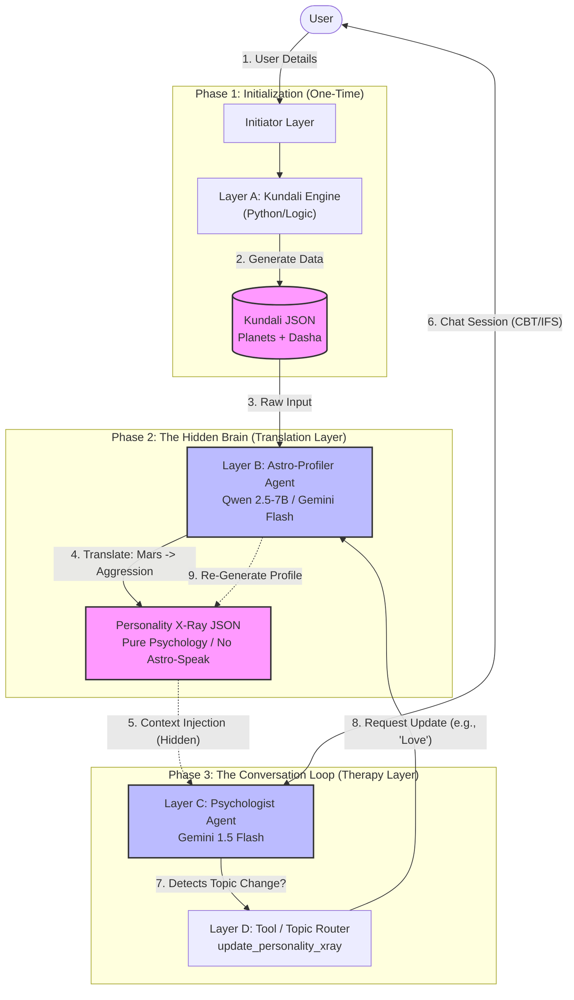

# Detailed summary of your **Astro-Therapist Agentic Architecture**

### **Architectural Overview**

This system represents a **Context-Aware Generative AI** architecture designed to function as a "Hidden Brain" therapist. Unlike standard chatbots that rely solely on conversation history, this agent possesses a pre-calculated, immutable psychological blueprint of the user derived from Vedic Astrology.

The core design philosophy is **"Translation, not Prediction."** The system translates astrological determinism (planetary positions) into psychological tendencies (attachment styles, cognitive behaviors), allowing the user-facing agent to provide deep, personalized therapy (CBT/IFS) without ever revealing the astrological source data.

---

### **System Architecture Diagram**

---

### **Detailed Component Breakdown**

#### **Phase 1: Initialization (The Calculation Layer)**

* **Goal:** Establish the mathematical ground truth.
* **Layer A: Kundali Engine (Python/Logic)**
* **Function:** This is a deterministic code layer (not an LLM) that accepts user birth details and calculates planetary positions, degrees, and the Vimshottari Dasha timeline.
* **Output (`KJSON`):** A raw JSON object containing astronomical data (e.g., `{"Saturn": {"house": 8, "sign": "Pisces"}, "Dasha": "Rahu-Jupiter"}`).
* **Role:** Acts as the immutable database for the session.
* **API Docs:** to generate a kundali details:
  * [Astro Details](https://astrologyapi.com/docs/api-ref/4/astro_details)
  * [Planets Extended](https://astrologyapi.com/docs/api-ref/73/planets/extended)
  * [Whole Vimshottari Dasha](https://astrologyapi.com/docs/api-ref/24/current_vdasha_all)
  * [General Ascendant Report](https://astrologyapi.com/docs/api-ref/38/general_ascendant_report)
* **Sample Output JSON**: The final output JSON formed using all above APIs for example: @docs/kundali.json

#### **Phase 2: The Hidden Brain (The Translation Layer)**

* **Goal:** Convert "Astrology Data" into "Psychological Data" to prevent the Therapist agent from hallucinating or sounding like a fortune teller.
* **Details Analysis:** @docs/kundali-analysis.md
* **Layer B: Astro-Profiler Agent (Qwen 2.5-7B / Gemini Flash)**
* **Function:** This agent acts as a **translator**. It takes the `KJSON` and applies a rigorous "Translation Dictionary" to map planetary archetypes to behavioral psychology.
* **Logic Example:**
* *Input:* "Moon in Capricorn" + "Saturn Dasha".
* *Translation:* "Emotional need for achievement" + "Current phase of isolation/burnout".

* **Output (`XRAY`):** A `Personality X-Ray JSON` containing **zero** astrological vocabulary. It describes the user's *Attachment Style*, *Cognitive Distortions*, and *Core Drives*.
* Output Schema: @docs/personality-x-ray-schema.json
* Output Example: @docs/personality-x-ray-example.json

#### **Phase 3: The Conversation Loop (The Therapy Layer)**

* **Goal:** Deliver high-quality mental health support using the hidden context.
* **Layer C: Psychologist Agent (Gemini 1.5 Flash)**
* **Persona:** "Dr. Nova," a Clinical Psychologist specializing in CBT (Cognitive Behavioral Therapy) and IFS (Internal Family Systems).
* **The "Hidden Brain" Rule:** This agent is strictly forbidden from using words like "Planet," "Star," or "Retrograde." It uses the injected `XRAY` context to "intuit" the user's struggles.
* **Behavior:** If the X-Ray indicates the user is in a "High Energy/Anger" phase (Mars), the therapist suggests active coping mechanisms (exercise) rather than passive ones (meditation).

* **Layer D: Tool / Topic Router (Dynamic Re-Indexing)**
* **Function:** A function-calling mechanism (`update_personality_xray`).
* **Trigger:** If the user shifts the conversation from "General Anxiety" to a specific domain like "Relationship Problems" or "Career Crisis."
* **Action:** It pauses the chat, calls **Layer B** again with a new `focus_topic`, generates a new, domain-specific `XRAY`, and injects it back into **Layer C**. This ensures the therapist's insights remain relevant to the specific life area being discussed.

### **Key Technical Advantages**

1. **Safety & Professionalism:** By stripping astrology vocab in Phase 2, the final output (Phase 3) is clinically sound and avoids "fatalism" (e.g., telling a user they are "doomed").
2. **Hyper-Personalization:** The therapist understands the user's *root cause* (e.g., "You overthink because you need control") rather than just reacting to their surface-level text.
3. **Cost & Speed Efficiency:** The heavy logic (Phase 1 & 2) runs only once (or on-demand), while the lightweight chat loop (Phase 3) remains fast and responsive.
